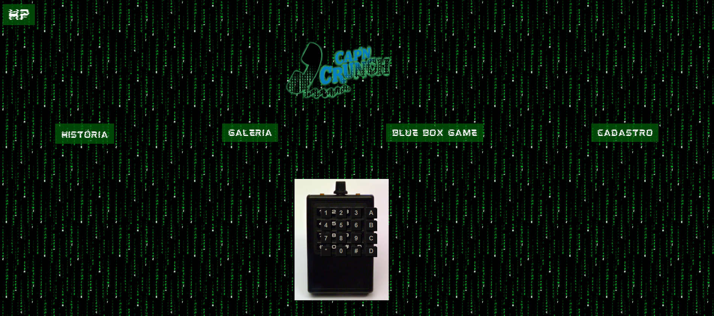
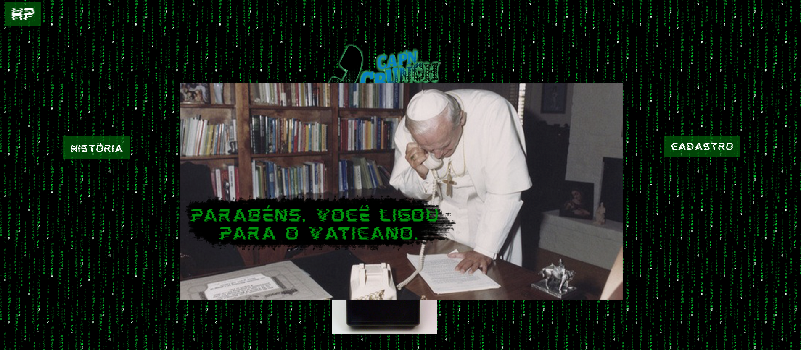

arquivos do jogo que eu fiz para o trabalho interdisciplinar da ETEC.

o site já está online aqui https://capitaocrunch.000webhostapp.com/
  

  <h3>Página inicial. Os botões estão meio deslocados, mas o foco aqui foi o javascript. Os botões fazem barulhinho também.</h3>
  

  

  <h3>Se digitar a combinação correta, uma imagem aparece. Tem outras além da imagem do papa</h3>
  

  
<h3>Atividade feita para o fim do primeiro semestre de DS</h3>
